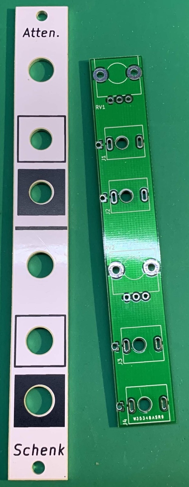
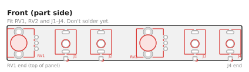
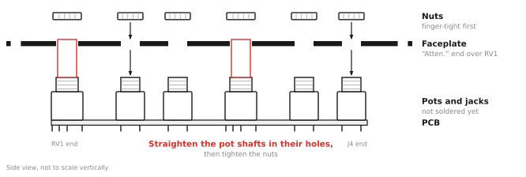
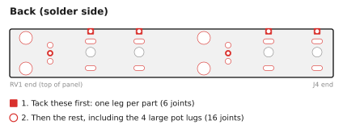

# Passive Attenuator — Assembly Guide

Building this kit takes about 20–30 minutes and needs 22 solder joints. It is a good first Eurorack kit.

**Prefer to watch?** There's a video of the whole build: [Watch me solder together a passive attenuator module!](https://www.youtube.com/watch?v=RKkGsIigaSM)

## What you need

### Kit contents

Check your kit against this list before you start (full details in the [BOM](BOM.md)):

- [ ] 1 × main PCB
- [ ] 1 × faceplate
- [ ] 4 × 3.5 mm jacks with nuts
- [ ] 2 × 100 kΩ linear potentiometers with nuts
- [ ] 2 × knobs

### Tools

- Soldering iron (about 330–360 °C for leaded solder)
- Solder
- Flush cutters
- Multimeter with continuity (beep) and resistance modes
- Nut driver or wrench for the jack and pot nuts (optional, but it avoids scratching the panel)

## Before you start

- The pots and jacks go on the **front** of the PCB, which is the side with the part outlines (RV1, RV2, J1–J4). The side printed "Passive Attenuator v1.0 / schenktronics.com" is the back, and you solder there.
- **Do not solder anything until the faceplate is fitted.** The pot shafts and jacks all pass through the faceplate, which holds them in line while you solder. Parts soldered first can end up crooked in their panel holes.

## Step 1 — Fit the pots and jacks

1. Push the two pots into RV1 and RV2 from the front of the PCB. Each pot fits only one way round: the three pins go in the row of three small holes and the two mounting lugs go in the large holes. The lugs clip into the board and hold the pot in place.
2. Insert the four jacks into J1–J4 from the front of the PCB. Make sure each jack sits flat, with all three legs through their pads.
3. Don't solder anything yet.

## Step 2 — Fit the faceplate

1. Remove the nuts (and any washers) from the pots and jacks.
2. Lower the faceplate over the parts. The "Atten." label goes at the top, over RV1. The pot shafts go through the two larger holes.
3. Put the nuts back on and tighten them **finger-tight** for now.
4. Check that each pot shaft sits straight and centered in its hole, and that the PCB is parallel to the faceplate. The legs have a little play in their holes, which gives you room to adjust.
5. Tighten the nuts snugly. Do not overtighten them, because that can crack the jack threads or mark the panel.

## Step 3 — Solder the pots and jacks

Turn the assembly over and solder from the back of the PCB.

1. Tack one leg of each part: the square pad of each jack and the middle pin of each pot. Then check again that everything still sits straight. If it doesn't, reheat that joint and adjust.
2. Solder the remaining pins and pads.
3. Solder the four large mounting-lug pads of the pots. They connect to the ground plane, so they take a little longer to heat. Hold the iron on until the solder flows into the hole.
4. Trim any long leads with flush cutters.

Inspect every joint. Each one should be shiny and cone-shaped, with no bridges between neighboring pads.

## Step 4 — Fit the knobs

Line up the flat inside each knob with the flat on the pot shaft, and push the knob on until its skirt covers the pot nut. The D-shaped shaft sets the knob's position, so there's nothing to align. Check that each knob turns without rubbing on the panel.

## Step 5 — Test

Test with a multimeter. No power is needed. The easiest way to reach the tip and sleeve of a jack is to plug in a patch cable and probe its plug. "Beep" means continuity mode; "Ω" means resistance mode.

| Test | Expected result |
|------|-----------------|
| Sleeve of any jack ↔ sleeve of every other jack | Beep |
| In 1 tip ↔ Out 1 tip, Level 1 fully clockwise | Beep, or a few ohms |
| Out 1 tip ↔ sleeve, Level 1 fully anticlockwise | Beep, or a few ohms |
| In 2 tip ↔ Out 2 tip, Level 2 fully clockwise | Beep, or a few ohms |
| Out 2 tip ↔ sleeve, Level 2 fully anticlockwise | Beep, or a few ohms |
| Cable in In 1 only: In 1 tip ↔ Out 2 tip, Level 2 fully clockwise | Beep (the normal is working) |
| Same, with a second cable plugged into In 2 | **No beep** (the normal is broken) |
| In 1 tip ↔ sleeve, nothing in In 2 (Ω) | About 50 kΩ (both pots in parallel). **Near 0 Ω means a short.** Check for solder bridges. |
| In 2 tip ↔ sleeve, cable in In 2 (Ω) | About 100 kΩ. **Near 0 Ω means a short.** |

## Step 6 — Install

Install the module in your case with two M3 screws. Usage details are in the [User Manual](manual.md).

## Troubleshooting

| Symptom | Likely cause |
|---------|--------------|
| One jack is dead | That jack has a cold or missing solder joint. Reflow its legs. |
| Out 2 is silent with a cable in In 1 and nothing in In 2 | The normalling contact on J3 (In 2) isn't soldered well. Reflow all three J3 legs. |
| A knob does nothing, or the output jumps | A bad joint on that pot. Reflow its three pins. |
| The signal is shorted to ground | There is a solder bridge between a tip pad and a ground pad or lug. |
| A knob rubs on the panel | The knob is pushed on too far. Pull it out slightly. |
| A pot shaft is crooked in its hole | It was soldered before the nuts were tightened. Loosen the nuts, reheat the pot's pins and lugs, and straighten it. |
| Full level is a little quieter than the input | This is normal for a passive attenuator. See [Good practice](manual.md#good-practice) in the manual. |
