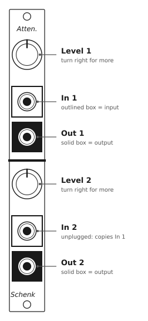
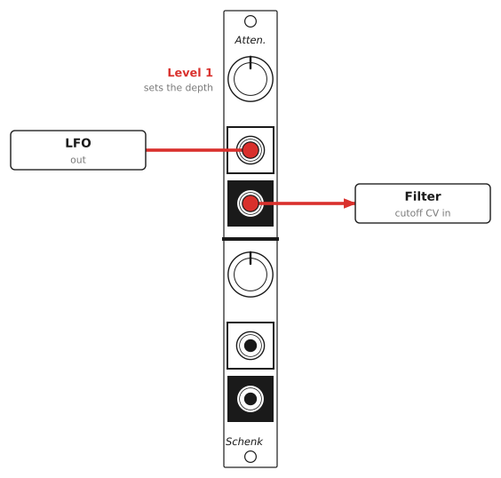
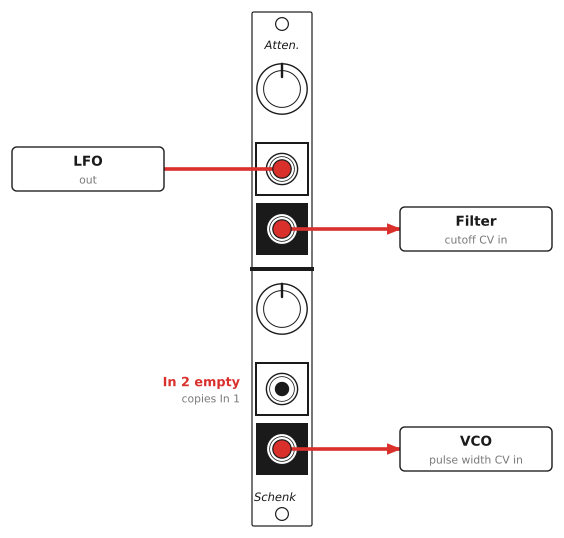
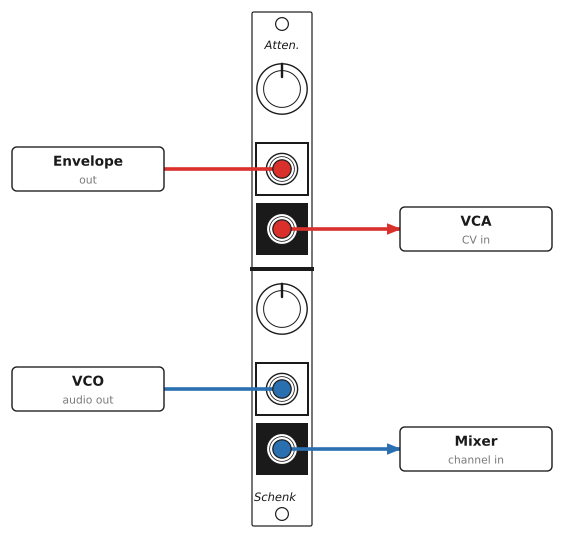

# Passive Attenuator — User Manual

## Overview

The Passive Attenuator is a 3HP Eurorack utility module with two attenuators. Each one takes a signal at its input and gives you a quieter or smaller copy at its output, set by its knob. In 2 is normalled to In 1, so a single signal can feed both channels at different levels.

The module is just jacks and potentiometers, so it does not need power.

## Specifications

| | |
|---|---|
| Format | Eurorack, 3HP |
| Panel | 15 × 128.5 mm |
| Depth | 15 mm (skiff-friendly) |
| Power | None needed |
| Jacks | 4 × 3.5 mm mono (TS): 2 inputs, 2 outputs |
| Controls | 2 × level knobs, 100 kΩ linear potentiometers |
| Range | Off (fully anticlockwise) to full level (fully clockwise). It can't amplify or invert. |
| Signals | Audio, CV, gates, and both unipolar and bipolar signals |

## Panel layout

The panel has two identical channels, separated by the thick line. In each channel, the knob is at the top, the input is the jack in the **outlined box**, and the output is the jack in the **solid box**.

## Using the module

### Level knobs

Turn a knob clockwise for more signal. Fully anticlockwise, the output is at 0 V (off). Fully clockwise, the output is close to the full input signal. It is never louder than the input, because the module has no amplifier.

The knob scales the signal toward 0 V. A bipolar LFO swinging ±5 V becomes a smaller swing around 0 V. It isn't shifted or offset.

### Normalled input

In 2 is normalled to In 1. When nothing is plugged into In 2, channel 2 gets its signal from In 1. Plug a cable into In 2 to break the normal and use the channels separately.

So with one cable into In 1:

- **Out 1** gives the signal at the Level 1 setting.
- **Out 2** gives the same signal at the Level 2 setting.

This is a quick way to send one modulation source to two places at different depths.

### Using it on audio

An attenuator on an audio signal is a volume control. Use it to bring a hot oscillator down before a filter or effect, or to set a manual mix level before a mixer that has no level controls.

## Patch examples

Each drawing shows the module that sends the signal on the left and the modules that receive it on the right.

### Set the depth of an LFO

Many filter CV inputs have no attenuator, so a full-size LFO sweeps the filter from closed to wide open. Patch the LFO through channel 1 and use Level 1 to set how far it sweeps.

### One LFO at two depths

Leave In 2 empty and the LFO reaches both channels. Here Level 1 sets how much the filter moves and Level 2 sets how much the pulse width moves, from one cable.

### Two separate attenuators

With a cable in In 2, the channels are independent. Here channel 1 sets how far an envelope opens a VCA, and channel 2 turns a VCO down before a mixer.

## Good practice

- **Patch outputs into the inputs.** Plug sources into the In jacks (outlined boxes). Nothing breaks if you patch into an Out jack instead, but the knob won't work as expected.
- **Full level is slightly below the input.** A passive attenuator loads the module feeding it and the module it feeds. With typical Eurorack modules, fully clockwise gives a little less than the original signal, and the middle of the knob gives a bit less than half. This is normal for any passive attenuator. For exact levels, use a buffered attenuator.
- **Pitch CV (V/oct):** attenuating a pitch CV changes the intervals, so the oscillator won't track in tune. That can be a creative effect, but it's not a way to transpose.
- **One source into both channels:** when In 2 is empty, In 1 feeds both knobs, so it loads the source a little more. It makes no difference with most modules.
- **Grounds:** the sleeves of all four jacks are wired together.

## Installation

1. Power off your case. The module does not need power, but you should never work in a powered case.
2. Place the module in any 3HP space. There is no ribbon cable to connect.
3. Secure it with two M3 rack screws. Do not overtighten them.

## Circuit

Each channel is one potentiometer wired as a voltage divider. The input jack's tip goes to one end of the pot, the other end goes to ground, and the wiper goes to the output jack's tip. In 2 (J3) is a switched jack: its normalling contact is wired to the tip of In 1 (J1), so In 1 feeds channel 2 until a plug is inserted in In 2. All sleeves and the pots' mounting lugs are wired to ground. The schematic is in [PassiveAttenuator/PassiveAttenuator.sch](../PassiveAttenuator/PassiveAttenuator.sch) (KiCad 5).
